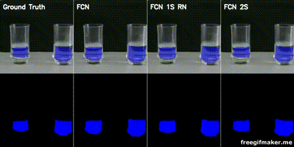

# Tensor Flow implementation of FCN for liquid detection in cups and glasses.



## Dataset
You can download the dataset [here](https://drive.google.com/open?id=19D2r6SOjK9edD9cSja3GCpKsDMSqKO9F).

## Instructions

1 - Download the dataset on the link above and extract it under a directory named 'data'.

2 - Make sure to change the directories in train_nirct_mm.py to match your data structure.

3 - Adjust the hyperparameters on line 35 of train_nirct_mm.py as you please. The default number of epochs is set to 60, but 20 give good results as well (and finishes in a third of the time).

4 - Change the 'model_name' in line 50 to a name of your choosing.

5 - Run the program by using the following command in the command line:
```sh
$ python3 train_nirct_mm.py
```
6 - The program will run and give you the results in a new directory under a directory named 'runs' created automatically.

## License

MIT License.
